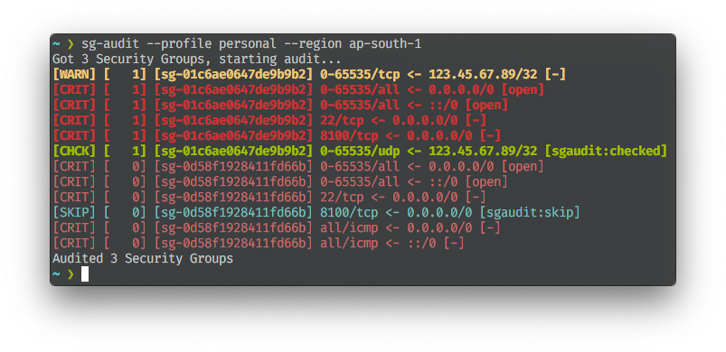

# Security Groups Audit

This command line application will process each Security group and check for
unnecessary ports that are open.

# Scope

## Security Groups
* Describe Security Groups
* Describe Security Groups with Filters
* Describe Security Groups of Running Instances

## Validation
* Check for any 0.0.0.0/0 or ::/0 values other than 80 and 443
* Check for All Traffic open as well, ports 0-65535

# Usage

There are some options available as of now.

* -csv for printing out in CSV format, this can be helpful for showing it in
reports.
* -no-color for disabling the color output.
* -profile and -region for AWS Profile (credentials) and Region to use.

```
$ sg-audit -h
Usage of sg-audit:
  -csv
        Output in CSV Format
  -no-color
        No Colored output
  -profile string
        AWS Profile to use
  -region string
        AWS Region to use
```

## Screenshot



## Legends

* **BOLD** indicates atleast one instance is attached with this security group
* `[CRIT]` or the line in red indicates the rule is open to internet
* `[WARN]` or the line in yellow indicates the rule is all ports are open to one of the IP
* `[SKIP]` or the line in cyan indicates the rule is marked as skip in Description
* `[CHCK]` or the line in green indicates the rule is marked as checked in Description

# LICENSE
MIT
